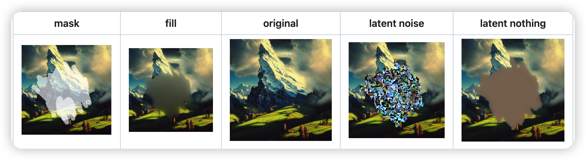

## Inpainting

In img2img tab, draw a mask over a part of the image, and that part will be in-painted.

文件后缀 `inpainting.ckpt`

### Masked content

The masked content field determines content is placed to put into the masked regions before they are inpainted.

### Inpaint area

Normally, inpainting resizes the image to the target resolution specified in the UI. With `Inpaint area: Only masked` enabled, only the masked region is resized, and after processing it is pasted back to the original picture. This allows you to work with large pictures and render the inpainted object at a much larger resolution.

### Masking mode

- `Inpaint masked `- the region under the mask is inpainted
- `Inpaint not masked` - under the mask is unchanged, everything else is inpainted

## Outpainting

Outpainting extends the original image and inpaints the created empty space.

You can find the feature in the img2img tab at the bottom, under Script -> Poor man's outpainting.

Outpainting, unlike normal image generation, seems to profit very much from large step count. A recipe for a good outpainting is a good prompt that matches the picture, sliders for denoising and CFG scale set to max, and step count of 50 to 100 with Euler ancestral or DPM2 ancestral samplers.

## upscale

SD upscale from the scripts dropdown selection (img2img tab)

The input image will be upscaled to twice the original width and height, and UI's width and height sliders specify the size of individual tiles. Because of overlap, the size of the tile can be very important: 512x512 image needs nine 512x512 tiles (because of overlap), but only four 640x640 tiles.

Recommended parameters for upscaling:

- Sampling method: Euler a
- Denoising strength: 0.2, can go up to 0.4 if you feel adventurous
